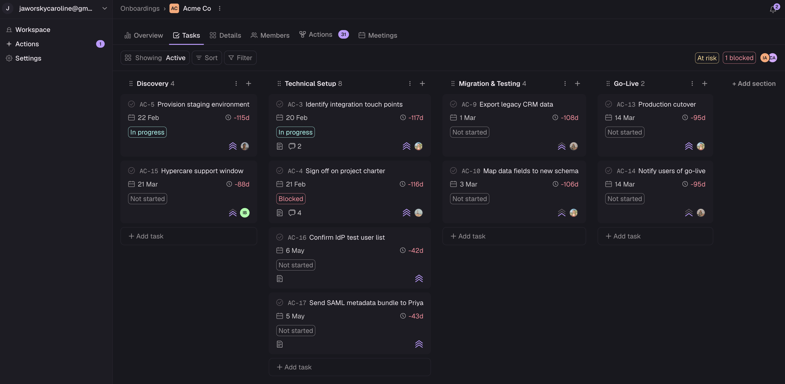
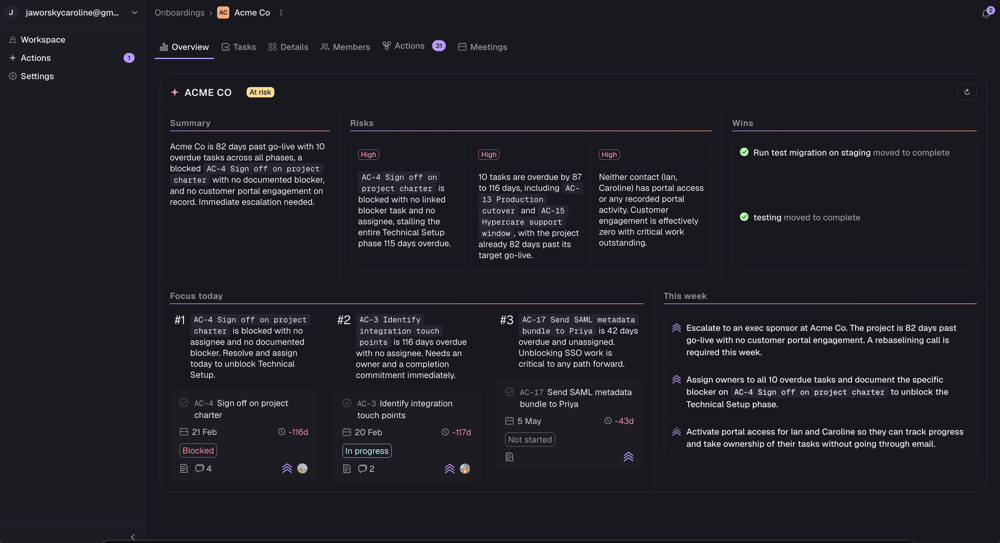
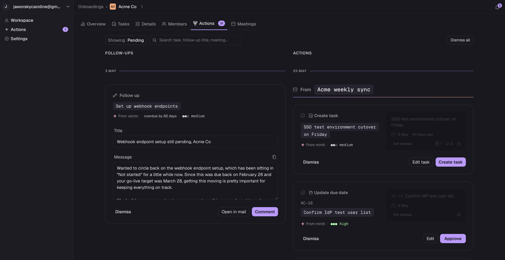

# Vector

**An AI-native onboarding platform for B2B SaaS.** Vector helps vendors cut time-to-value
and stop first-90-day churn. It's a shared vendor/customer workspace with an AI layer that
does the tedious work: drafting follow-ups, turning meeting transcripts into tasks, and
surfacing risk before an onboarding goes dark.

🔗 **[vector.quest](https://vector.quest)** · built with Next.js 16, Prisma, Supabase, and the Anthropic Claude API.

_Designed and built solo by Caroline Jaworsky: product, data model, AI orchestration, design system, and deploy._

> _Most onboarding tools optimise for the vendor's internal project management. Vector
> optimises for the **shared experience**, keeping both sides aligned, with AI handling
> the follow-up work that usually falls through the cracks._

---

## A look inside

| Kanban board | AI Insights | Review queue |
|---|---|---|
|  |  |  |


## Why it exists

B2B SaaS teams (Seed to Series B) feel onboarding pain acutely but can't justify $30k/yr
enterprise tools like Rocketlane or GuideCX. They hack it together with spreadsheets and
repurposed PM tools, and customers go dark, time-to-value slips, and accounts churn in
the first 90 days. Vector is purpose-built for that gap: lightweight enough to adopt in a
day, with a zero-friction customer portal and an AI layer that earns its keep.

---

## What makes it different

- **Nothing said in a meeting gets lost.** Half the work of an onboarding is agreed
  verbally ("we'll send the SOW Friday," "IT still needs to provision SSO"), and then it
  evaporates the moment the call ends. Vector plugs into transcription platforms, ingests
  every meeting, and turns the action points into drafted tasks (or updates to existing
  ones). The vendor reviews a clean queue instead of re-watching recordings.

- **AI that tells you where to look, globally and granularly.** Insights work at two
  altitudes: a portfolio view that flags which onboarding needs attention today across the
  whole book of business, and a per-onboarding view that narrows to the specific tasks,
  risks, and customer signals that matter right now. You stop scanning ten boards looking
  for the fire.

- **Predictive health, not a binary flag.** Every onboarding is scored **On track / At
  risk / Blocked** from its actual data: overdue tasks, completion velocity against the
  go-live date, blocked-task ratio, and customer engagement. "At risk" comes with its
  *reasons* ("2 tasks overdue · behind pace, 6 tasks left, 9d to go-live"), so it's
  actionable rather than just amber.

- **A customer portal people actually use.** No signup, no password, no account to create.
  A customer clicks a magic link and lands straight on their tasks. They can mark work
  done, upload files, and leave comments. Engagement is tracked (`lastSeenPortalAt`) so the
  vendor knows the moment a customer goes quiet.

- **Notifications keep both sides in the loop.** Every status change, comment, upload, and
  portal visit flows into a built-in vendor inbox (grouped, read/unread), and customers see
  an "updates since you were last here" banner. The conversation lives *in* the tool
  instead of scattered across email threads.

- **CRM-agnostic.** Integrate later via API. Vector never requires you to be on a
  particular CRM to get value on day one.

---

## The AI layer

Four AI capabilities ship in production, all **human-in-the-loop**: Vector drafts,
a person approves. Nothing is sent or changed autonomously.

| Capability | What it does |
|---|---|
| **AI Insights (per-onboarding)** | Streaming "Insights" tab: `headline`, `focusToday`, `focusThisWeek`, `risks`, `wins`, `nudges`, `trend`. Cached by context-hash with a 4h soft TTL. |
| **Portfolio Insights + admin dashboard** | Hero card on the home dashboard streams a portfolio-wide summary highlighting which onboardings need attention. `/admin/ai` surfaces cost, error rate, p95 latency, and integration health. |
| **Meeting → tasks (transcript integration, Miniti)** | Webhook ingests meeting transcripts → a tool-use orchestrator drafts task creates / status changes / reassignments → they land in an `/ai-drafts` inbox for approve / reject / **edit-before-approve** / assign. |
| **Autonomous stale-task scanner** | Weekly Vercel cron + manual "Scan now" drafts follow-up nudges for stalled tasks, scoped to each task's owner. |

### How it's built

The interesting engineering is in keeping an LLM **grounded, cheap, and observable**:

- **Three-layer split.** Deterministic JavaScript computes the hard signals
  (`tasksOverdue`, `velocity7d`, `customerEngagement`, phase state…) → Claude reasons in
  narrative over a 2-5 KB JSON snapshot → the result is cached against a hash of the input
  state. The LLM never does arithmetic it can get wrong.
- **No hallucinated facts.** The system prompt forces every claim to cite a specific
  `taskId` / `onboardingId` / named field. "Could be a problem later" with no evidence is
  explicitly *not* allowed to count as a risk.
- **Structured output** via `output_config.format` with a JSON schema, and **prompt
  caching** (`cache_control: ephemeral`) on the system prompt.
- **Streaming** through Edge Runtime: `client.messages.stream()` over SSE. The Supabase
  JS client is used in the edge route because Prisma's `adapter-pg` isn't edge-compatible.
- **Tool-use orchestration** for transcripts: a single Claude call emits `create_task` /
  `match_to_existing_task` / `update_status` tool calls, each carrying a `sourceQuote` and
  a confidence rating, written to a review queue rather than applied directly.
- **Full cost observability.** Every Claude call is logged to an `AICall` table with
  input/output/cache tokens, USD cost, duration, and the Anthropic `request_id` for
  cross-referencing. Portfolio-scale usage runs **under $5/month**.
- **Webhooks-only ingestion** (no polling), idempotent via a `(source, sourceId)` unique
  index. Stuck events surface in the admin panel with a per-row reprocess button.

---

## Product surface

### Vendor workspace
- **Kanban board per onboarding**: phases as columns (Kickoff → Configuration → Data
  Migration → Training → Go-Live), drag-and-drop via [dnd-kit](https://dndkit.com/).
- **Rich task model**: status tags, owners, due dates, dependencies (`blockedByTask`),
  customer-side assignees, comments, file uploads, and Jira-style `{PREFIX}-{NUMBER}` IDs
  (e.g. `AC-12`) so tasks can be referenced in conversation and AI drafts.
- **Portfolio dashboard**: predictive health across all onboardings with an AI summary and
  risk points surfaced.
- **Built-in notifications**: every status change, comment, upload and link activation,
  grouped into a vendor inbox with read/unread state.
- **Magic-link invites**: customer portal links delivered via [Resend](https://resend.com),
  with bounce/complaint webhook handling.

### Customer portal
- **Zero-friction entry**: magic link, no signup, no password, no account to create.
- Customers see their tasks, mark them done, upload files, and leave comments.
- Engagement tracked via `lastSeenPortalAt` so vendors know who's active, and an "updates
  since you were last here" banner keeps returning customers oriented.

---

## Roadmap

- **Linear integration**: sync issue status both ways so engineering work tracked in
  Linear stays reflected on the onboarding board, using the same orchestrator and review
  queue as the meeting-transcript flow.
- **Attio integration**: pull deal context from the CRM so an onboarding inherits the
  account history the sales team already captured.
- **Confidence-gated auto-execute**: once a source sustains a high accept-rate (~90%),
  let the highest-confidence drafts apply automatically while everything else stays in the
  human review queue. Trust is earned per integration, not switched on globally.

---

## Tech stack

| Layer | Choice | Notes |
|---|---|---|
| Framework | **Next.js 16** (App Router, JavaScript) | Webpack, not Turbopack (PostCSS compatibility) |
| UI | **React 19**, **Tailwind CSS v4** | CSS-first config, no `tailwind.config.js` |
| Design system | **DESIGN.md** as canonical source | `app/theme.css` autogenerated by `scripts/build-theme.mjs`; `npm run lint:ds` validates contrast and token references |
| ORM | **Prisma 7** with `@prisma/adapter-pg` | 16 models, cascade deletes throughout |
| Database | **Supabase Postgres** | Transaction pooler for app, direct pooler for migrations |
| Auth (vendor) | **Supabase Auth** | Email/password, JWT refresh in `proxy.js` middleware |
| Auth (customer) | **Custom magic links** | UUID tokens in a `MagicLink` table with `expiresAt` / `revokedAt` / `lastUsedAt`; scoped visitors, not `auth.users` rows |
| AI | **Anthropic Claude Sonnet 4.6** via `@anthropic-ai/sdk` | Streaming, structured output, prompt caching, tool use |
| Email | **Resend** | Bounce/complaint webhook with signature verification |
| Drag-and-drop | **dnd-kit** | Kanban reordering and phase moves |
| Testing | **Playwright** | End-to-end (`npm run test:e2e`) |
| Hosting | **Vercel** | Edge Runtime for streaming routes, Vercel Cron for the scanner |
| Linting | **ESLint 9** flat config | |

---

## Project structure

```
app/
  api/                 # 18 route groups (tasks, onboardings, insights, integrations, cron, webhooks…)
  onboardings/[id]/    # Vendor Kanban board
  portal/[onboardingId]/ # Customer magic-link portal
  admin/ai/            # Cost + integrations dashboard
  ai-drafts/           # "Vector suggests" inbox
  components/          # Feature components (TaskCard, Sidebar, TaskDrawer, AIDraftInbox…)
  ui/                  # Design system primitives (Button, IconButton, TaskIdChip…)
  globals.css          # Tailwind + theme.css + component classes

lib/
  db.js                # ALL database access, NaN-safe ID validation, not-found returns
  health.js            # Pure health scoring (no DB)
  ai/                  # client, context, insights, orchestrator, scan-stale
  integrations/miniti.js
  supabase/            # server.js (cookies-based) + client.js (browser) + proxy.js
  portal-auth.js       # Magic-link verification

prisma/
  schema.prisma        # 16 models including AICall, ExternalEvent, PendingAIChange, Insight
  seed.js              # Seeds sample companies and tasks

scripts/
  build-theme.mjs      # DESIGN.md → app/theme.css generator
  …diagnostics
```

**One rule worth repeating**: API routes and components never call Prisma directly.
Everything goes through `lib/db.js`. This keeps validation (`NaN` checks, not-found
returns) consistent and the data layer swap-friendly.

---

## Reference docs in this repo

| File | Purpose |
|---|---|
| [PLAN.md](PLAN.md) | Product vision, ICP, full feature breakdown by phase |
| [AI_PLAN.md](AI_PLAN.md) | AI implementation plan: current state, architecture, decisions |
| [DESIGN.md](DESIGN.md) | Design system source of truth: tokens, components, do's and don'ts |
| [DECISIONS.md](DECISIONS.md) | Architectural decisions with rationale |
| [DATABASE_SETUP.md](DATABASE_SETUP.md) | Postgres + Prisma setup walkthrough |

---

## Getting started

```bash
# 1. Install
npm install

# 2. Configure environment
cp .env.example .env
# Fill in DATABASE_URL, NEXT_PUBLIC_SUPABASE_*, ANTHROPIC_API_KEY (for AI features)

# 3. Migrate + seed
npx prisma migrate dev
npm run seed

# 4. Run
npm run dev   # http://localhost:3000
```

Predev/prebuild hooks regenerate the design tokens (`npm run build:ds`) automatically.

### Scripts

| Command | Purpose |
|---|---|
| `npm run dev` | `next dev --webpack` |
| `npm run build` | `next build --webpack` |
| `npm run lint` | ESLint |
| `npm run lint:ds` | Validate DESIGN.md (contrast, broken token refs, schema) |
| `npm run build:ds` | Regenerate `app/theme.css` from DESIGN.md |
| `npm run seed` | Seed DB with sample companies and tasks |
| `npm run test:e2e` | Run Playwright end-to-end tests |

---

## Adding screenshots

The "A look inside" table references images in a `docs/` folder at the repo root.

1. Capture the screens (macOS: `Cmd+Shift+4` for a region, `Cmd+Shift+5` to record a short
   clip). Animated GIFs work too and are great for the streaming insights.
2. Save them as `docs/board.png`, `docs/insights.png`, `docs/ai-drafts.png` (the filenames
   the table already points at). Create the `docs/` folder if it doesn't exist.
3. Reference any image with relative markdown: ``.
4. Commit the files. GitHub renders repo-relative image paths automatically, so they show
   up in the README without any hosting.

Keep images reasonably small (under ~1 MB each, ~1600px wide) so the repo stays light.
